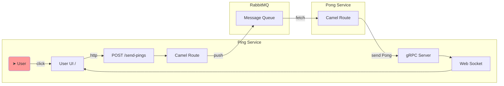

{:toc}

# Enterprise Ping Pong

Demo project for playing around with Quarkus to create microservices. 


# Architecture

Initiated by the user via the UI, the Ping Service sends `Ping` messages to RabbitMQ, the Pong Service fetches these, convert them into `Pong` messages and sends them back via gRPC to the ping service which then collects some metrics and sends them to the user UI via a websocket.




# How to start

- Start RabbitMQ

  ```bash
  cd docker
  docker-compose up
  ```

- Start the Ping Service

  ```
  cd ping
  mvn compile quarkus:dev
  ```

- Start the Pong Service

  ```
  cd pong
  mvn compile quarkus:dev
  ```

- Go to `http://localhost:20080/` to access the user UI


# Used technologies

Guides for all used can be found here: https://quarkus.io/guides/


## `quarkus-resteasy-reactive`

- Provides HTTP endpoints via "reactive programming" (via Mutiny)
- See `src/main/java/io/github/ss3rg3/ping/endpoints`.
- All HTTP respondes are served as `Uni`, e.g. `Uni<Response>`, `Uni<TemplateInstance>`.
- All `Uni`'s are simply served via `Uni.createFrom().item()`, i.e. it's served by the same thread that handles the request. If you have some blocking operation you might want to use `Uni.createFrom().completionStage()` instead to move it into another thread.


## `quarkus-qute` & `quarkus-resteasy-reactive-qute`

- Templating engine. Can be used anything, e.g. HTML files.

- See `src/main/java/io/github/ss3rg3/ping/endpoints/IndexEndpoint.java`

- Quarkus provides neet helpers to load the templates. You just put them into `src/main/resources/templates` and can access them via 

  ```java
  @Path("/")
  public class IndexEndpoint {
  
      private final Template index; // loads "src/main/resources/templates/index.qute.html"
  ```

  

## `quarkus-grpc`

- gRPC servers and code generator for `.proto` files.

- See

  - `src/main/proto/PingService.proto` (Definition of the gRPC server)
  - `src/main/java/io/github/ss3rg3/ping/grpc/PingServiceImpl.java` (Implementation of the gRPC server)

- On every code change Quarkus generates a lot of classes in `target/generated-sources/grpc`

- To use this gRPC server in another service you need to add the `PingService.proto` to it. See `pong/src/main/proto/PingService.proto` (note the `pong`). 

- Quarkus seems not be capable to source these files from an external location. The easiest way is therefore to have script which copies the Protobuf files into the subprojects, see `/sync_proto.sh`

- To play around with gRPC servers you can use `grpcurl` (see [here](https://github.com/fullstorydev/grpcurl)). This allows to query a server via curl-like commands:

  ```bash
  grpcurl -plaintext localhost:9200 list
  grpcurl -plaintext -d '{"count": "1"}' localhost:9200 pingpong.PingService/receivePong
  ```

- There's also https://github.com/fullstorydev/grpcui


## `quarkus-rest-client-reactive`

- Helper for creating (very simple) clients to consume REST services

- See `ping/src/main/java/io/github/ss3rg3/ping/restclients`

- Easy peasy like that:

  ```java
  @Path("/singlesearch") // Path in the API
  @Produces(MediaType.APPLICATION_JSON)
  @RegisterRestClient(baseUri = "http://api.tvmaze.com") // Can also be configued via application.properties
  public interface TvSeriesProxy {
  
    @GET
    @Path("/shows")	// i.e. http://api.tvmaze.com/singlesearch/shows 
    TvSeries get(@QueryParam("q") String query); // i.e. shows?q=YOUR_PARAM
  }
  ```

- There don't seem to be options available to configure the clients and there's no logic. E.g. timeouts don't seem to configurable. 

- For marshalling objects you need `quarkus-rest-client-reactive-jackson` NOT `quarkus-resteasy-reactive-jackson`.


## `quarkus-hibernate-validator`

- Bean validator, see `ping/src/main/java/io/github/ss3rg3/ping/config/PingConfig.java`

- Cool thing is that RestEasy supports this out of the box. Simply use `@Valid`, e.g.

  ```java
  @PUT
  @Produces(MediaType.APPLICATION_JSON)
  @Consumes(MediaType.APPLICATION_JSON)
  public Uni<Response> putConfig(@Valid PingConfig newPingConfig) {
  ```

  

## `quarkus-config-yaml`

- Quarkus config but as YAML
- See `ping/src/main/resources/application.yml`
- Supports contexts and all. 
- IntelliJ linter has lots of problems with it. Restarting the program helps.


## `quarkus-jackson` & `quarkus-resteasy-reactive-jackson`

- For marshalling & unmarshalling JSON.

- Allows to automatically create objects from HTTP requests, e.g.

  ```java
  @GET
  @Path("/shows")	
  TvSeries get(@QueryParam("q") String query); 
  ```


## `quarkus-arc` (CDI, @Inject etc)

- Dependency injection
- See `@ApplicationScoped`, `@inject`, `@Startup` for examples


## `quarkus-websockets`

- Web sockets. See
  - `ping/src/main/java/io/github/ss3rg3/ping/websocket/StatusSocket.java`
  - `ping/src/main/resources/META-INF/resources/status-socket.js`

- Easy as creating a class with `@ServerEndpoint` how to handle connections via `@OnOpen`, `@OnMessage`, etc.
- In the JS you then just implement an appropriate client


## `quarkus-smallrye-health`

- Health endpoints which tell you if some component is up or down.
- See `ping/src/main/java/io/github/ss3rg3/ping/health/PongServiceHealthCheck.java`
- You create a class with e.g. `@Liveness` which `implements HealthCheck`. The returned `HealthCheckResponse` will then be rendered into the standardized endpoints, e.g. `localhost/q/health`


## `quarkus-micrometer-registry-prometheus`

- Metrics endpoints with standardized output for various programs, e.g. Prometheus. There are also helpers to gather custom metrics and publish them.
- The endpoint metrics `/q/metrics` is automatically created and contains lots of info about the JVM
- You can add custom metrics via using `MeterRegistry`. Just inject it and use its counters, timers, summaries, etc.
- See `ping/src/main/java/io/github/ss3rg3/ping/metrics/Meters.java`


## `quarkus-scheduler`

- Allows to call non-private methods in beans periodically 

- See `ping/src/main/java/io/github/ss3rg3/ping/metrics/Meters.java`

- Just annotate with `@Scheduled`

  ```java
  @Scheduled(every = "1s")
  void measureTransactionsPerSecond() {
      double pongsReceivedCount = this.pongsReceived.count();
      this.pongPerSecond = pongsReceivedCount - this.lastPongCount;
      this.lastPongCount = pongsReceivedCount;
  }
  ```

  

## Camel

- `quarkus-grpc` & `camel-quarkus-grpc` seem to have been incompatible in Quarkus `2.10.3.Final`
- But it's no problem to use without the Quarkus library
- See `ping/src/main/java/io/github/ss3rg3/ping/camel`
- `CamelBean` holds the `CamelContext` and is simply injected wherever needed.
  - The `CamelContext` is started on `@Startup`
  - And it's shut down when the application stops, see `void onStop(@Observes ShutdownEvent ev)`


## Squirrel FSM

- FSM for reporting the state of the application to the user UI via web socket.

- See `ping/src/main/java/io/github/ss3rg3/ping/fsm/ServiceFSM.java`

- On state changes the action `sendToWebSocket()` is performed, e.g.

  ```java
  builder.externalTransition().from(ServiceState.UNAVAILABLE)
          .to(ServiceState.AVAILABLE)
          .on(ServiceEvent.ALL_SERVICES_UP)
          .perform(this.sendToWebSocket());
  ```

  